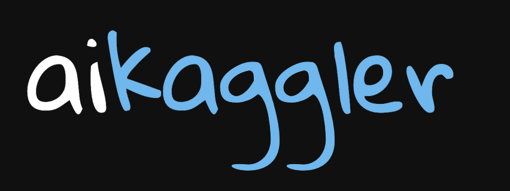

<p align="center">
  
</p>

# aikaggler

Toolkit for competing in Kaggle competitions.

## Install

```sh
uv sync
```

## Plugins

### `solution_analysis` — scrape top forum writeups, extract structured solutions with a local LLM (Ollama)

```sh
just solutions <competition-slug>
# or
uv run akc solutions <competition-slug> [--limit 20] [--pages 5] [--model gemma4:latest]
```

Output goes to `data/<slug>/`:

```
data/<slug>/
├── competition.json
├── github_links.json
├── aggregated_analysis.json      # cross-solution superset (LLM)
├── aggregated_summary.md         # human-readable digest
└── solutions/
    └── rank_NN/
        ├── solution.md           # cleaned writeup
        └── analysis.json         # per-solution structured fields
```

Requires a running Ollama instance at `localhost:11434` with the chosen model pulled.
